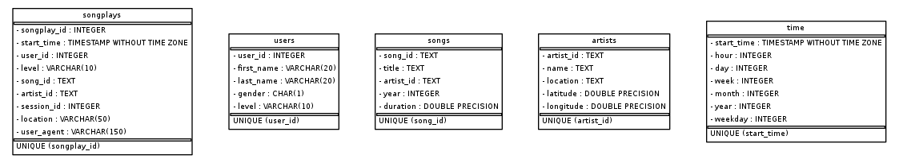

# Data Modeling with Postgres

## **Overview**
A startup wants to analyze the data they've been collecting on songs and user activity on their new music streaming app. 
Currently, they are collecting data in json format and the analytics team is particularly interested in understanding what songs users are listening to.

## **Technique**
In this project, we apply Data Modeling with Postgres and build an ETL pipeline using Python. 
from the input datasets: 1. Song Dataset, 2. Log Dataset, We create Star Schema. We create ETL program to populate de-normalized tables from input datasets.

## **Approach**
1. All the files in subdirectories in songs_data and log_data are traversed with python glob module.
2. Pandas Dataframe has been created with filtered data
3. As a part of star schema, Fact/ Dimension tables are created
4. Appropriate constraints in table fields has taken care such as Primary Key, NOT NULL.
5. Appropriate data type have been chosen for each fields for tables.
6. Timestamp column is typecasted to datetime to convert python.int type (Postgresql bigint) to datetime.
7. Day, week, month, year etc. extracted and saved in time table.
8. ETL queries created and run to populated Dimension tables
9. To populate fact table: songsplay (inner) join query with songs table and artist table created with artist_id as common fields between two tables.
10. Run test.ipynb for sanity checks constraints and data availability in the tables.


## **Song Dataset**
Songs dataset is a subset of [Million Song Dataset](http://millionsongdataset.com/).

Sample Record :
```
{"num_songs": 1, "artist_id": "ARJIE2Y1187B994AB7", "artist_latitude": null, "artist_longitude": null, "artist_location": "", "artist_name": "Line Renaud", "song_id": "SOUPIRU12A6D4FA1E1", "title": "Der Kleine Dompfaff", "duration": 152.92036, "year": 0}
```

## **Log Dataset**
Logs dataset is generated by [Event Simulator](https://github.com/Interana/eventsim).

Sample Record :
```
{"artist": null, "auth": "Logged In", "firstName": "Walter", "gender": "M", "itemInSession": 0, "lastName": "Frye", "length": null, "level": "free", "location": "San Francisco-Oakland-Hayward, CA", "method": "GET","page": "Home", "registration": 1540919166796.0, "sessionId": 38, "song": null, "status": 200, "ts": 1541105830796, "userAgent": "\"Mozilla\/5.0 (Macintosh; Intel Mac OS X 10_9_4) AppleWebKit\/537.36 (KHTML, like Gecko) Chrome\/36.0.1985.143 Safari\/537.36\"", "userId": "39"}
```


## Schema

#### Fact Table 
**songplays** - records in log data associated with song plays i.e. records with page `NextSong`

```
songplay_id, start_time, user_id, level, song_id, artist_id, session_id, location, user_agent
```

#### Dimension Tables
**users**  - users in the app
```
user_id, first_name, last_name, gender, level
```
**songs**  - songs in music database
```
song_id, title, artist_id, year, duration
```
**artists**  - artists in music database
```
artist_id, name, location, latitude, longitude
```
**time**  - timestamps of records in  **songplays**  broken down into specific units
```
start_time, hour, day, week, month, year, weekday
```

### ER Diagram


## Project Files

```sql_queries.py``` -> contains sql queries for dropping and  creating fact and dimension tables. Also, contains insertion query template.

```create_tables.py``` -> contains code for setting up database. Running this file creates **sparkifydb** and also creates the fact and dimension tables.

```etl.ipynb``` -> a jupyter notebook to analyse dataset before loading. 

```etl.py``` -> read and process **song_data** and **log_data**

```test.ipynb``` -> a notebook to connect to postgres db and validate the data loaded.


### Optional files

```create_erd.py``` -> to create ER Diagram of sparkify db from postgresql db

```sparkifydb_erd.png``` -> ER Diagram generated from create_erd.py program

## Environment 
Python 3.7 or above

PostgresSQL 9.5 or above

psycopg2 - PostgreSQL database API for Python


## How to run

Run the drive program ```main.py``` as below.
```
python main.py
``` 

The ```create_tables.py``` and ```etl.py``` file can also be run independently as below:
```
python create_tables.py 
python etl.py 
```


 #### Reference: 
[Psycopg](http://initd.org/psycopg/docs/)

[PostgreSQL Documentation](https://www.postgresql.org/docs/)

[Pandas Documentation](https://pandas.pydata.org/pandas-docs/stable/)
